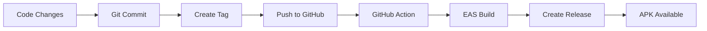

# 🚀 Release and Distribution Guide

## 📱 GitHub Releases Setup (Direct APK Download)

### Prerequisites
1. **GitHub Repository**: Push your project to GitHub
2. **Expo Account**: Create free account at expo.dev
3. **TMDB API Key**: Working API key from themoviedb.org

### 🔧 Setup Steps

#### 1. GitHub Repository Setup
```bash
# Initialize git repository (if not already done)
git init
git add .
git commit -m "Initial commit: Movie Watchlist App"

# Add your GitHub repository as remote
git remote add origin https://github.com/yourusername/movie-watchlist.git
git branch -M main
git push -u origin main
```

#### 2. GitHub Secrets Configuration
Go to your GitHub repository → Settings → Secrets and Variables → Actions
Add these secrets:

- **EXPO_TOKEN**: Get from https://expo.dev/accounts/[username]/settings/access-tokens
  ```
  Name: EXPO_TOKEN
  Value: your_expo_access_token_here
  ```

#### 3. Create Your First Release
```bash
# Tag your release
git tag -a v1.0.0 -m "🎬 Movie Watchlist v1.0.0 - Initial Release"
git push origin v1.0.0
```

### 🏗️ Manual APK Building

If you prefer to build manually:

```bash
# Install EAS CLI globally
npm install -g eas-cli

# Login to Expo
eas login

# Configure project for EAS Build
eas build:configure

# Build APK for distribution
eas build --platform android --profile production
```

### 📋 Release Checklist

Before creating a release:

- [ ] ✅ **TMDB API Key**: Ensure your API key is working
- [ ] ✅ **Testing**: Test app thoroughly on Android device
- [ ] ✅ **Version**: Update version in app.json
- [ ] ✅ **Changelog**: Document new features/fixes
- [ ] ✅ **Assets**: Ensure all icons and images are optimized
- [ ] ✅ **Build**: Successful EAS build completion

### 🌐 Distribution URLs

When your GitHub Action builds successfully, your APK will be available at:

**GitHub Releases URL:**
```
https://github.com/yourusername/movie-watchlist/releases
```

**Direct Download URL (latest release):**
```
https://github.com/yourusername/movie-watchlist/releases/latest/download/movie-watchlist.apk
```

### 📱 TMDB Application URL

Update your TMDB API application with:
```
https://github.com/yourusername/movie-watchlist/releases
```

Or for a more professional approach, use GitHub Pages:
```
https://yourusername.github.io/movie-watchlist
```

### 🔄 Automated Release Process

The GitHub Action will automatically:

1. **Trigger**: On git tag push (v*.*.*)
2. **Build**: Android APK using EAS Build
3. **Test**: Run basic validation
4. **Release**: Create GitHub release with APK
5. **Notify**: Generate release notes

### 📊 Release Workflow



### 🛠️ Troubleshooting

**Common Issues:**

1. **Build Fails**: Check EXPO_TOKEN secret
2. **APK Too Large**: Optimize images in assets/
3. **API Errors**: Verify TMDB API key validity
4. **Install Issues**: Enable "Unknown Sources" on Android

**Debug Build Locally:**
```bash
# Preview build
eas build --platform android --profile preview --local

# Check build logs
eas build:list
```

### 📈 Release Strategy

**Version Numbering:**
- `v1.0.0` - Major release (new features)
- `v1.1.0` - Minor release (improvements)
- `v1.1.1` - Patch release (bug fixes)

**Release Frequency:**
- Major releases: Monthly
- Minor releases: Bi-weekly
- Patch releases: As needed

### 🔐 Security Considerations

1. **API Keys**: Never commit API keys to repository
2. **Secrets**: Use GitHub secrets for sensitive data
3. **Permissions**: Review Android permissions before release
4. **Signing**: EAS Build handles code signing automatically

### 📞 Support

**For Users:**
- Issues: GitHub repository issues tab
- Documentation: README.md
- Contact: pritamkarmakar@example.com

**For Developers:**
- EAS Build docs: https://docs.expo.dev/build/introduction/
- GitHub Actions: https://docs.github.com/en/actions

---

## 🎉 Success!

Your Movie Watchlist app is now set up for automated APK building and distribution through GitHub Releases!

**Next Steps:**
1. Push your code to GitHub
2. Create your first release tag
3. Share the GitHub Releases URL
4. Update your TMDB application settings

**Your APK download URL will be:**
`https://github.com/yourusername/movie-watchlist/releases`
